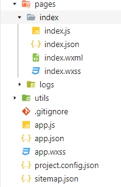
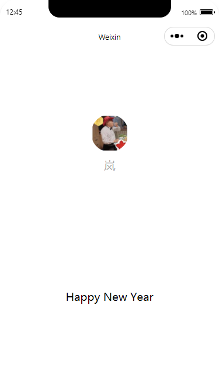

# WxAPP Day01

## 一.  注册

从注册开始，需要一个全新的邮箱，这个邮箱之前不能绑定微信号，微信公众号以及小程序。

填写玩必要信息后，会生成一个小程序ID，用来匹配开发工具的ID

## 2.  开发

在一个空文件夹新建工程后会自动生成一个简易的项目，功能只有获得用户头像，昵称。还有在屏幕上显示

Hello world

一开始下面是一行HelloWorld，我更改了一次

## 感悟

今天再次打开小程序，理解又不一样了。目前看来一个小程序似乎完全是一个简易的手机H5网页。

里面的js就是js，Wxml就是HTML，Wxss就是CSS，不过还有一个json是新出的功能，简单的研究发现，他们的逻辑结构类似于Vue，是那种MVVM的模型，像那句Hello World不在Wxml里，而是js定义的数据。