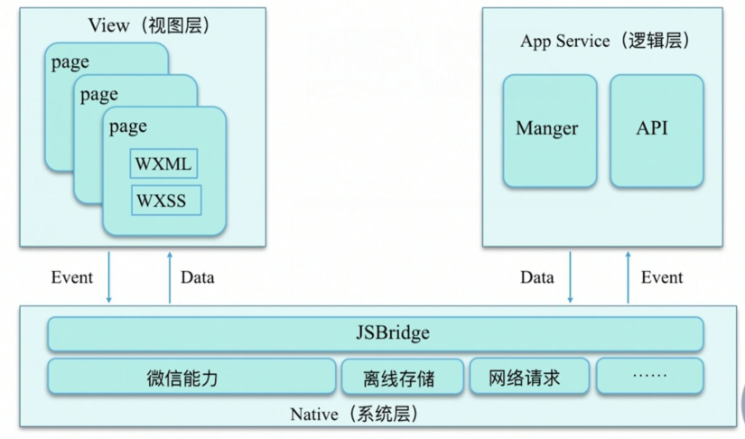
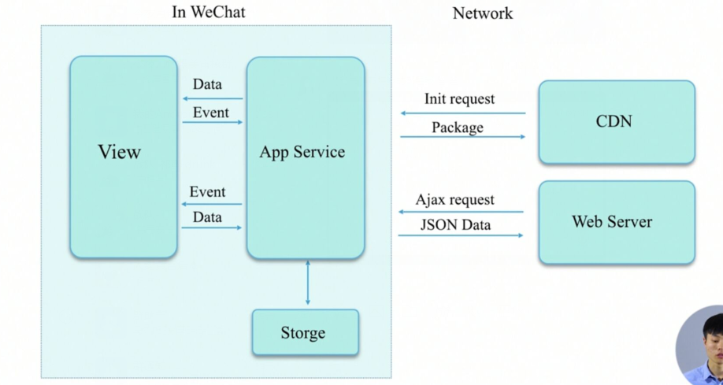
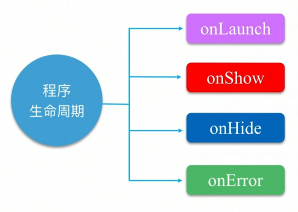
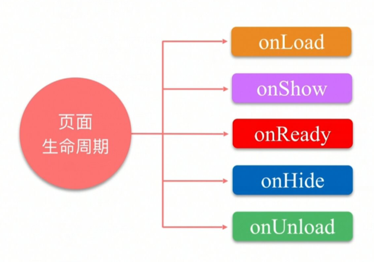
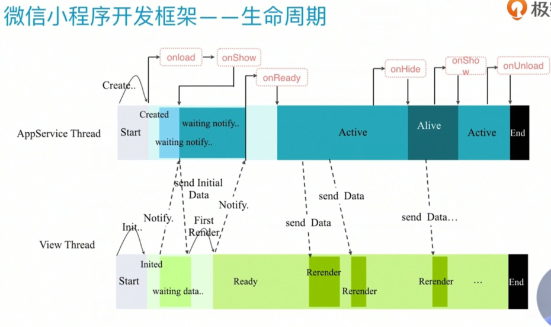
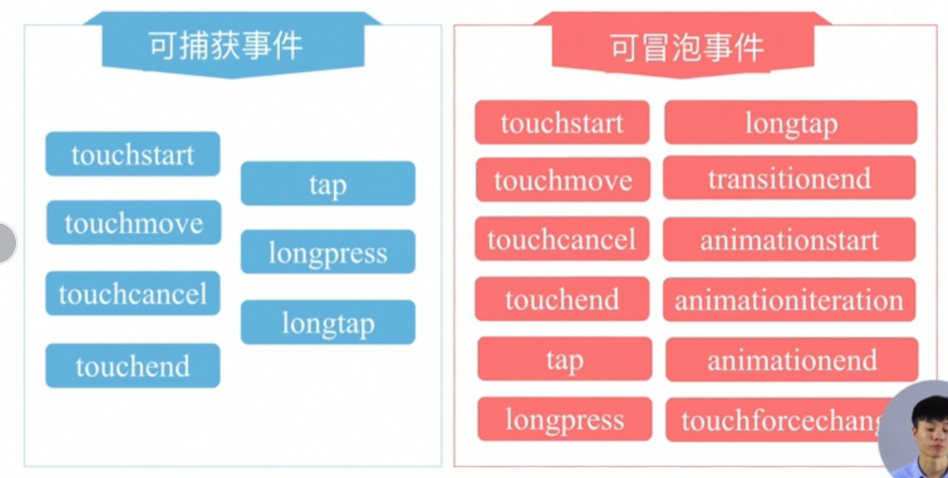
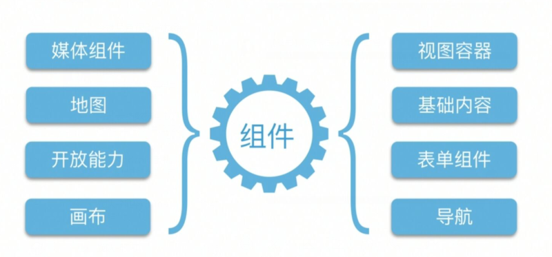
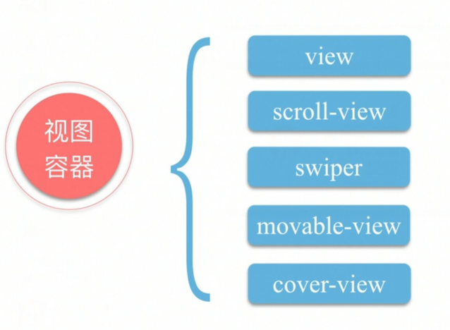

# WxAPP Day03


## 小程序框架MINA





通过JSBridge进行双线程通信


## 小程序运行，加载机制

启动   热启动和冷启动





## 小程序的生命周期


### 程序



### 页面




### 完整流程




## 路由


| 路由方式   | 页面栈表现                           |
| ---------- | ------------------------------------ |
| 初始化     | 新页面入栈                           |
| 打开新页面 | 新页面入栈                           |
| 页面重定向 | 当前页面出栈，新页面入栈             |
| 页面返回   | 页面不断出栈，直到返回页，新页面入栈 |
| Tab切换    | 页面全部出栈，只留下新的Tab页面      |
| 重加载     | 页面全部出栈，只留下新的页面         |


| 路由方式   | 触发时机                                                     | 路由当前页 | 路由后页面       |
| ---------- | ------------------------------------------------------------ | ---------- | ---------------- |
| 初始化     | 小程序打开的第一个页面                                       |            | onLoad，onShow   |
| 打开新页面 | 调用API  `wx.navigateTo`或使用组件`<navigator open-type="navigateTo">` | onHide     | onLoad，onShow   |
| 页面重定向 | 调用API  `wx.redirectTo`或使用组件`<navigator open-type="redirectTO>"` | onUnload   | onLoad，onShow   |
| 页面返回   | 调用API  `wx.navigateBack`或使用组件`<navigator open-type="navigateBack>"`或用户按左上角返回 | onUnload   | onShow           |
| Tab切换    | 调用API  `wx.SwitchTab或使用组件`<navigator open-type="SwitchTab>"`或用户切换Tab |            | 各种情况参考下表 |
| 重启动     | 调用API  `wx.reLaunch或使用组件`<navigator open-type="reLaunch>"` | onUnload   | onLoad，onShow   |


## 小程序事件流


#### 样例-绑定点击事件


```html
<!--index.wxml-->
<view>
	<view class="btn" bindyap="clickMe">
    	点击我！
    </view>
</view>
```


```js
//index.js
Page({
    clickMe(e){
        console.log(e);
    }
})
```


#### 事件模型

冒泡与捕获





长按与短按  间隔350ms


## view容器


小程序中的组件




视图组件的分类




