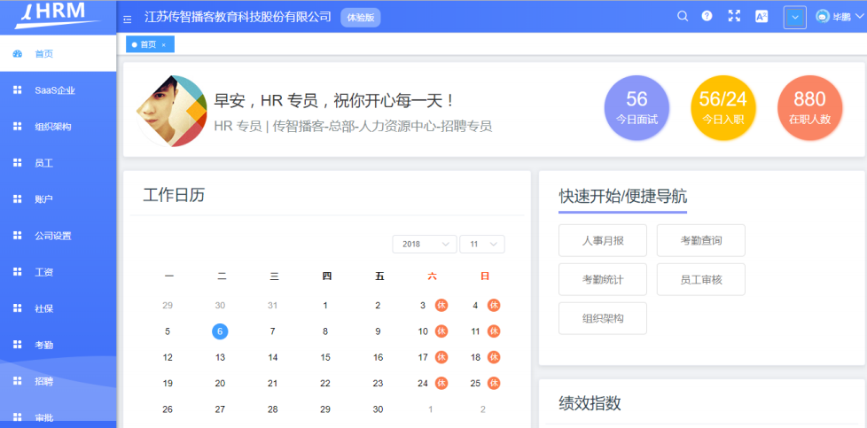
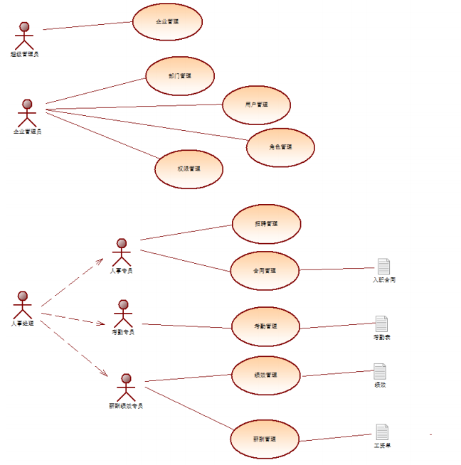
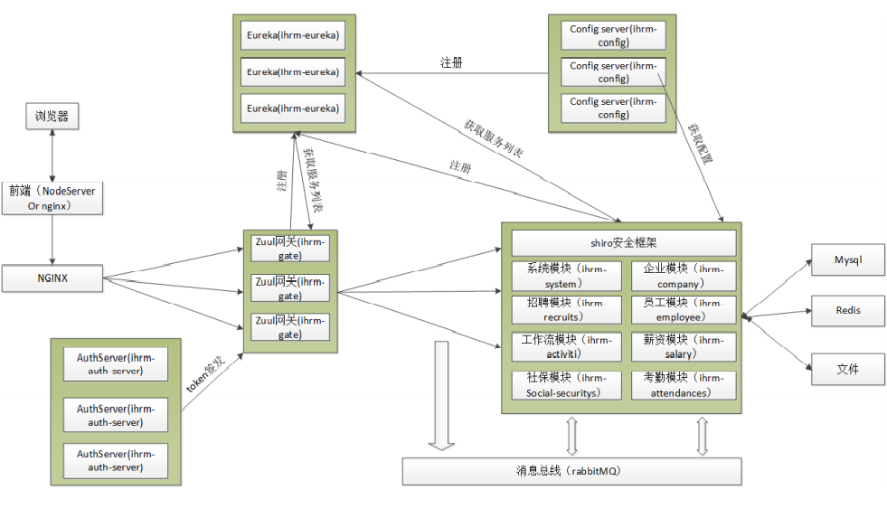

# README

## 项目介绍

​			:next_track_button: Sass-HRM 是基于saas模式的人力资源管理系统。他不同于传统的人力资源软件应用，使用者只需要打开浏览器即可管理上百人的薪酬、绩效、社保、入职离职。

## 前端展示

## 用例图

## 技术栈

:bookmark_tabs: 前端：以Node.js为核心的Vue.js前端技术生态架构

:bookmark_tabs: 后端：SpringBoot+SpringCloud+SpringMVC+SpringData

## 开发环境

JDK 1.8

MySQL 5.7

maven 3.3.9

## 系统架构

